<!-- Banner + snake are served from this repo. Badges are shields.io.
     Nothing here depends on a hobby-tier third-party renderer staying up. -->

  

  
  
  
  

<!-- 🟢 NEW DEDICATED TECH STACK SECTION -->
<h2 align="center">🛠️ My Tech Stack</h2>

  
  
  
  
  
  
  
  

 

I turn vague asks into checkable questions, then answer them in SQL, Power BI and Excel — and publish the working out, bugs included.

 

---
 

## 📂 Projects

Click any row to open the write-up.

| | Project | Headline | Stack |
|:--:|:--|:--|:--|
| 🕵️ | **[PaySim Fraud Detection](https://github.com/Plensia/PaySim-Fraud-Analysis)** | **97.7% of fraud caught, zero false positives** across 6.36M transactions | `Python` `PostgreSQL` `Power BI` |
| 🏭 | **[Maven Fuzzy Factory](https://github.com/Plensia/maven-fuzzy-factory-etl)** | **1.2M+ rows**, incremental ETL → 5 dbt marts → dashboard, containerized | `Python` `PostgreSQL` `dbt` `Docker` |
| 📈 | **[LinkedIn Content Performance](https://github.com/Plensia/linkedin-content-performance-analysis)** | Loudest posts ≠ best posts — recap content converted at **39.5%** | `Excel` |
| ☕ | **[Coffee Taste Test](https://github.com/Plensia/great-american-coffee-taste-analysis)** | Stated preference survived the blind test, across **4,023** respondents | `Power BI` `Power Query` |

<!-- 🟢 REPLACED WITH: MY ROADMAP -->
<h2>🧭 My Roadmap</h2>

  <i>Building the bridge from business questions to data infrastructure.</i>

   
  <strong style="font-size: 24px;"> ➡️ </strong> 
   
  <strong style="font-size: 24px;"> ➡️ </strong> 
  

 

<table align="center" width="80%">
  <tr>
    <td align="center" width="33%" style="border: 1px solid #14B8A6; border-radius: 10px; padding: 15px;">
      <h3>🎯 Stage 1: Analyst</h3>
      
<em>Where I am now</em>

      

        ✅ SQL & Python for deep analysis 
        ✅ Power BI & Excel for storytelling 
        ✅ Asking "why" and uncovering patterns
      

    </td>
    <td align="center" width="34%" style="border: 1px solid #1DB954; border-radius: 10px; padding: 15px;">
      <h3>🏗️ Stage 2: Engineer</h3>
      
<em>In progress</em>

      

        🔨 Building ETL pipelines (dbt, Airflow) 
        🐳 Containerizing with Docker 
        ☁️ Moving workflows to the cloud (AWS/Azure)
      

    </td>
    <td align="center" width="33%" style="border: 1px solid #FFD700; border-radius: 10px; padding: 15px;">
      <h3>🧩 Stage 3: Analytics Engineer</h3>
      
<em>The ultimate goal</em>

      

        🏗️ Designing data models for scale 
        🔗 Bridging the gap between data teams 
        🧠 Automating quality & reliability
      

    </td>
  </tr>
</table>

 

  <i>Currently, I'm building the foundation. Every project I ship gets me closer to the pipeline.</i>

 

<!-- 🟢 NEW: CURRENTLY LOOKING FOR (Instant Scannable Badge Style) -->

   
  

    
    
    
    
  

  
  

    <em>I translate vague business asks into bulletproof logic — in SQL, Power BI, and Python.</em>
  

  
  
  
    

<!-- 🟢 NEW: BEYOND THE CODE (Colorful Grid) -->
<h2>🎨 Beyond the Code</h2>

  When I step away from the screen, my world looks a little like this:

<table border="0" align="center" cellpadding="10">
  <tr>
    <td align="center" width="120" style="border: 1px solid #14B8A6; border-radius: 10px;">
       
      <strong>🎨 Sketching</strong>
    </td>
    <td align="center" width="120" style="border: 1px solid #1DB954; border-radius: 10px;">
       
      <strong>🎧 Music</strong>
    </td>
    <td align="center" width="120" style="border: 1px solid #FFD700; border-radius: 10px;">
       
      <strong>📖 Books</strong>
    </td>
    <td align="center" width="140" style="border: 1px solid #9b59b6; border-radius: 10px;">
      <strong>💇🏾‍♀️</strong> 
      <strong>Braiding</strong>
    </td>
  </tr>
</table>

  <i>Fun fact: I'm currently learning to braid my own hair. It's exactly like debugging code —  requires patience, finding the right pattern, and trusting that it'll look good(sometimes😅) once I'm done.</i>

 

## 🐍 Watch the commits get eaten

---

## 🎓 Credentials

  
  
  
  

---

  <i>Bring me a question you haven't finished defining yet.</i> 
  Tell me the decision waiting on the data, and I'll tell you what it can actually support.

