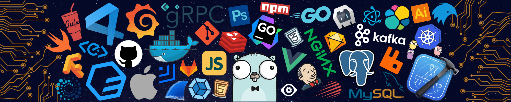

<!--   my-icons -->

    
    
    
    
    
       

<!--   my-header-img -->

  

&descAlign=79&fontAlign=50&descAlignY=70&fontColor=f7f5f5)

I'm a data analyst, front-end developer, and web designer from Tanzania. I turn data into meaningful stories, craft intuitive designs, and build engaging web experiences. Check out my creative process on Instagram @builtbysia!

<h3>Quick Links</h3>

    

 

<ul>
    <li>🔭 I love turning data into art that tells a story.</li>
    <li>🎨 Passionate about designing interfaces that feel intuitive and magical.</li>
    <li>👨‍💻 Always curious to code solutions that enhance web experiences.</li>
</ul>

<h2 id=lang>Skills</h2>

**Languages**

**Frameworks & Libraries**

**Data Science & ML**

**Databases**

**Tools**

<h2>Profile Links</h2>

    
    
    
    

<h2>☕️ Buy Me a Coffee</h2>

    

<picture>
  <source media="(prefers-color-scheme: dark)" srcset="https://raw.githubusercontent.com/tobiasmeyhoefer/tobiasmeyhoefer/output/github-snake-dark.svg" />
  <source media="(prefers-color-scheme: light)" srcset="https://raw.githubusercontent.com/tobiasmeyhoefer/tobiasmeyhoefer/output/github-snake.svg" />
  
</picture>

<h2> 
TODO:: Create Buy Me Coffee Account.</h2>